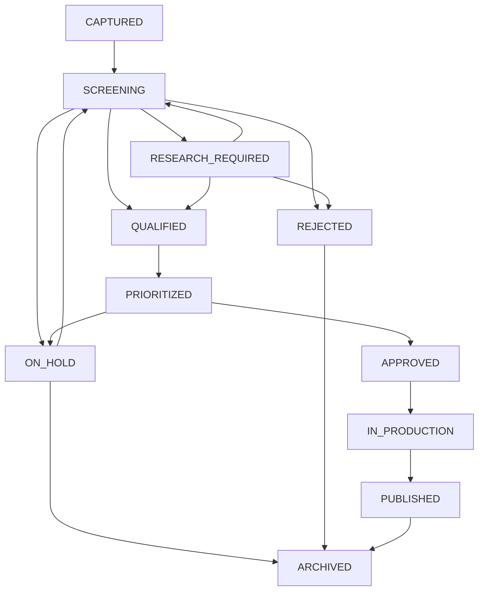

# NexaMOS Blog — Topic Qualification & Opportunity Scoring (Phase 1B)

**Status:** Canonical Engine Specification  
**Version:** 1.0 (TOPIC_PRIORITY_V1)  
**Date:** 2026-09-14  
**Project:** NexaMOS Blog Editorial Operating System  

---

## 1. Pemisahan Konsep: Qualification vs Prioritization

Sistem editorial NexaMOS memisahkan secara tegas dua tahap pengambilan keputusan ide editorial:

```text
CANDIDATE TOPIC
      ↓
[1. QUALIFICATION ENGINE]  →  Apakah ide ini layak menjadi editorial opportunity NexaMOS?
      ↓ (Hanya jika QUALIFIED)
[2. SCORING ENGINE]        →  Seberapa prioritas topik ini dibanding topik lain?
```

### Mengapa Harus Dipisahkan?
- **Qualification bukan sistem perankingan:** Kualifikasi adalah evaluasi berbasis gerbang (*gate-based pass/fail decision*). Suatu topik yang berpotensi menghasilkan trafik tinggi tetap **wajib ditolak** jika tidak lolos gerbang relevansi domain atau berisiko menjadi komoditas generik tanpa diferensiasi.
- **Prioritization bukan penentu kelayakan:** Penilaian prioritas hanya berlaku untuk topik yang sudah lolos seleksi kelayakan (*qualified*), guna mengalokasikan kapasitas penulisan dan riset editorial.

---

## 2. Enam Gerbang Kualifikasi (Six Qualification Gates)

Setiap topik dievaluasi melalui 6 gerbang deterministik di [`engines/ideation/topic-qualifier.ts`](file:///c:/Users/wishn/Documents/nexamos/engines/ideation/topic-qualifier.ts):

| Gerbang | Status yang Dihasilkan | Kriteria Evaluasi |
| :--- | :---: | :--- |
| **`TERRITORY_FIT`** | `PASS` / `FAIL` | Wajib selaras dengan salah satu dari 3 territory: `INTELLIGENCE`, `STRATEGY`, atau `TACTICAL`. Topik di luar fokus ini langsung gugur. |
| **`AUDIENCE_RELEVANCE`** | `PASS` / `FAIL` | Wajib memiliki segmen audiens spesifik (`audience.segment`) dan problem/job-to-be-done yang nyata dan terartikulasi. |
| **`KNOWLEDGE_VALUE`** | `PASS` / `FAIL` | Menilai apakah ada nilai kebaruan pengetahuan (`expectedContribution`) dan tipe orisinalitas (`originalityType`). |
| **`EVIDENCE_FEASIBILITY`** | `PASS` / `FAIL` / `UNKNOWN` | Rencana bukti (`evidencePlan`) tidak boleh `E0` (Unsupported). Jika membutuhkan `E3`/`E4` namun sumber belum terpetakan, gerbang menghasilkan `UNKNOWN` (memicu status `RESEARCH_REQUIRED`). |
| **`NON_COMMODITY_POTENTIAL`** | `PASS` / `FAIL` | Menguji risiko komoditas. Lolos jika `commodityRisk` rendah/sedang, atau jika tinggi namun memiliki rencana diferensiasi intelektual kuat. Pengecualian berlaku untuk peran `SUPPORTING` / `REFERENCE`. |
| **`BUSINESS_RELEVANCE`** | `PASS` / `FAIL` | Wajib memiliki sasaran bisnis (`objective`) dan peran perjalanan pelanggan (`funnelRole`) yang selaras dengan misi NexaMOS. |

### Matriks Keputusan Akhir
- **`REJECTED`:** Jika terdapat minimal 1 gerbang berstatus `FAIL`.
- **`RESEARCH_REQUIRED`:** Tidak ada gerbang `FAIL`, namun `EVIDENCE_FEASIBILITY` (atau informasi esensial lain) berstatus `UNKNOWN`.
- **`ON_HOLD`:** Lolos gerbang kelayakan namun sengaja ditangguhkan (timing/momentum).
- **`QUALIFIED`:** Seluruh 6 gerbang berstatus `PASS`.

---

## 3. Penanganan Risiko Komoditas & Pengecualian Konten Pendukung

### Aturan Risiko Komoditas (Commodity Risk Treatment)
1. **Risiko Komoditas Tinggi Tidak Otomatis Ditolak:** Jika `commodityRisk: HIGH`, sistem memeriksa apakah topik memiliki rencana pembuktian orisinalitas melalui:
   - `ORIGINAL_RESEARCH`, `ORIGINAL_DATA`, `ORIGINAL_FRAMEWORK`, `EXPERT_INTERPRETATION`, `CASE_STUDY`, `FIRST_HAND_OBSERVATION`, `STRONG_POINT_OF_VIEW`, `CROSS_THEORY_SYNTHESIS`, `TIMELY_ANALYSIS`, `PRACTICAL_DECISION_FRAMEWORK`.
   - Jika rencana diferensiasi substantif: status menjadi `QUALIFIED` atau `RESEARCH_REQUIRED`.
   - Jika risiko tinggi dan tidak ada rencana diferensiasi: status menjadi `REJECTED`.

### Pengecualian Konten Pendukung (Supporting Content Exception)
Sistem mengakui bahwa artikel definisi generik (misal: *"Apa itu CRM?"*, *"Pengertian Canonical Tag"*) tetap dibutuhkan untuk arsitektur situs.

Topik semacam ini diberikan pengecualian gerbang `NON_COMMODITY_POTENTIAL` bila diklasifikasikan sebagai:
- **`EDITORIAL_ROLE = SUPPORTING`** (Pendukung klaster topik, edukasi prasyarat, destinasi tautan internal).
- **`EDITORIAL_ROLE = REFERENCE`** (Entri glosarium teknis dan rujukan definisi baku).

> *Prinsip:* Konten pendukung tidak boleh dihakimi dengan ekspektasi novelty yang sama dengan artikel `FLAGSHIP` atau `AUTHORITY`.

---

## 4. Formula Penilaian Peluang (Opportunity Scoring Formula)

Scoring diimplementasikan pada [`engines/ideation/opportunity-scorer.ts`](file:///c:/Users/wishn/Documents/nexamos/engines/ideation/opportunity-scorer.ts) dengan versi kebijakan **`TOPIC_PRIORITY_V1`**.

### Bobot Dimensi Prioritas

| Dimensi Prioritas | Bobot Relatif | Deskripsi Penilaian (Skala 0–100) |
| :--- | :---: | :--- |
| **`strategicValue`** | **25% (0.25)** | Keselarasan terhadap doktrin NexaMOS dan pembentukan kategori (*category design*). |
| **`audienceValue`** | **25% (0.25)** | Tingkat urgensi problem dan dampak solusi bagi beban kerja audiens (*Job to be Done*). |
| **`differentiationPotential`** | **25% (0.25)** | Kekuatan keunikan intelektual yang sulit ditiru oleh model generatif publik. |
| **`timeliness`** | **15% (0.15)** | Momentum pasar, perubahan regulasi, atau tren pencarian terkini. |
| **`evidenceReadiness`** | **10% (0.10)** | Tingkat kematangan dan kemudahan akses terhadap dataset atau rujukan bukti. |

### Rumus Perhitungan
$$\text{overall} = \text{round}\Big((V_{\text{strat}} \times 0.25) + (V_{\text{aud}} \times 0.25) + (V_{\text{diff}} \times 0.25) + (V_{\text{time}} \times 0.15) + (V_{\text{evid}} \times 0.10)\Big)$$

### Prinsip Independensi Kualitas Topik vs Kesiapan Bukti
Bobot `evidenceReadiness` sengaja dibatasi hanya **10%**. 
- Topik yang sangat strategis, memiliki urgensi audiens tinggi, dan diferensiasi luar biasa namun memiliki bukti mentah (misal: `evidenceReadiness = 20`) **tetap mendapatkan skor tinggi (~86 / CRITICAL)**.
- Kesiapan bukti yang rendah adalah pemicu penugasan riset (`RESEARCH_REQUIRED`), bukan alasan mematikan ide brilian.

---

## 5. Klasifikasi Prioritas (Priority Classes)

Nilai komposit `overall` dipetakan ke dalam 5 kelas operasional:

| Skor Keseluruhan | Kelas Prioritas | Tindakan Operasional |
| :---: | :---: | :--- |
| **85 – 100** | **`CRITICAL`** | Topik prioritas puncak; alokasikan sumber daya riset dan penulisan segera. |
| **70 – 84** | **`HIGH`** | Peluang editorial unggulan; dijadwalkan masuk sprint produksi aktif. |
| **50 – 69** | **`MEDIUM`** | Topik bernilai baik atau konten pendukung klaster; dikerjakan secara paralel. |
| **30 – 49** | **`LOW`** | Prioritas rendah; dieksekusi bila ada jeda kapasitas atau kebutuhan tautan spesifik. |
| **0 – 29** | **`BACKLOG`** | Disimpan dalam antrean ide untuk dievaluasi ulang di masa mendatang. |

---

## 6. Integrasi Siklus Hidup (State Transitions)

Aturan transisi status dikelola oleh [`engines/ideation/topic-transition.ts`](file:///c:/Users/wishn/Documents/nexamos/engines/ideation/topic-transition.ts):



---

## 7. Contoh Keputusan Kualifikasi & Scoring

Berdasarkan data uji di folder [`data/topics/examples/`](file:///c:/Users/wishn/Documents/nexamos/data/topics/examples/):

1. **Flagship Framework (`signal-vs-insight.json`):**
   - *Status:* `QUALIFIED` (Lolos 6 gerbang).
   - *Prioritas:* Skor **93 / CRITICAL** (Nilai strategis 98, diferensiasi 96).
2. **Authority Analysis (`blog-ai-relevance.json`):**
   - *Status:* `QUALIFIED` (Lolos 6 gerbang).
   - *Prioritas:* Skor **92 / CRITICAL** (Sintesis multi-sumber otoritatif).
3. **Generic Commodity Term (`what-is-marketing.json`):**
   - *Status:* `REJECTED` (Gagal pada gerbang `KNOWLEDGE_VALUE` dan `NON_COMMODITY_POTENTIAL`).
   - *Penyebab:* Informasi generik publik tanpa sudut pandang, diferensiasi, atau peran pendukung yang jelas.
4. **Glossary Reference (`seo-basic-reference.json`):**
   - *Status:* `QUALIFIED` (Lolos gerbang `NON_COMMODITY_POTENTIAL` melalui *Supporting Content Exception* dengan `editorialRole: REFERENCE`).
   - *Prioritas:* Skor **59 / MEDIUM** (Berfungsi sebagai penopang kelengkapan klaster topik).
